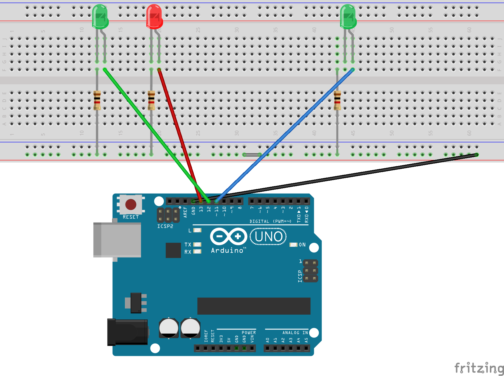

AR Server
===

Prequsities
---
- **node.js** : https://nodejs.org/en/
- Install all the required packages via `npm install`
- Arduino IDE : https://www.arduino.cc/en/main/software
- **Arduino Uno** with the following accessories
    - Bread-board
    - 2x 1k Ohm Resistors
    - 2x LED
    - 3x Jumper cables

Arduino setup
---

Install the `standardFirmataPlus` firmware (read more here: https://github.com/firmata/arduino#usage):
1. Connect Arduino
2. Navigate to `sketch > Include Library > Manage Libraries`
3. Filter by "Firmata" and click on the "Firmata by Firmata Developers" item in the list of results.
4. Click the Select version dropdown and select the most recent version (note you can also install previous versions)
5. Click Install.

You can now close the Arduino IDE, and clone this project into a folder.

Setup the circuit as given in the diagram below



Starting up the server
---

Make sure Arduino is connected. Start the server by running the command below
```
node app.js
```

The server should now be running, all the logs should displayed in the console.


*Created by Balraj Singh Bains for 4th Year Honours Dissertation at Heriot Watt University.*